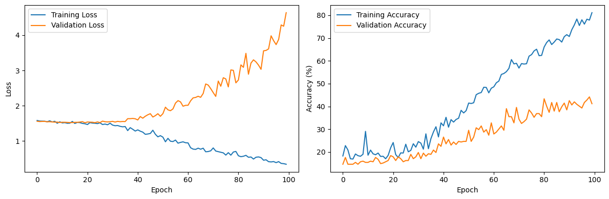
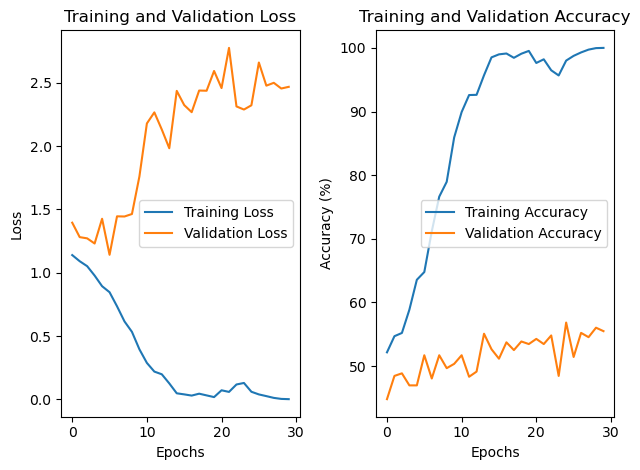

# RootResolverAI
 Use AI to do scoring of endodontic  treatment outcomes
 
 Repository for the Python code used in the project

## Update 18.09.2023
Have been to [PRESIMAL Autum Research School](https://mmiv.no/presimal/) and got so much valuable feedback.
- moved all old code to folder old
- started new approach using Pytorch (not because it's better than Tensorflow, but seems to be used more by the community)
- did proper normalisation (not only divide by 255 but same mean and stdev for all images)
- new model is learning
- new model is still not good on test data (overfitting?)

## TODO
- Try other models RESUNET is a promising candidate
- Try to use more data at once
- Make more high quality, high trust examples to learn

## Results
Training done in september 2023 on the whole dataset with a 80/20 split

### Simple CNN

An empty CNN of this shape:
| Layer (type)  | Output Shape      | Param #   |
|---------------|-------------------|-----------|
| Conv2d-1      | [-1, 32, 256, 256]| 320       |
| AvgPool2d-2   | [-1, 32, 128, 128]| 0         |
| Conv2d-3      | [-1, 64, 128, 128]| 18,496    |
| AvgPool2d-4   | [-1, 64, 64, 64]  | 0         |
| Conv2d-5      | [-1, 128, 64, 64] | 73,856    |
| AvgPool2d-6   | [-1, 128, 32, 32] | 0         |
| Linear-7      | [-1, 128]         | 16,777,344|
| Dropout-8     | [-1, 128]         | 0         |
| Linear-9      | [-1, 128]         | 16,512    |
| Dropout-10    | [-1, 128]         | 0         |
| Linear-11     | [-1, 5]           | 645       |

---

- **Total params**: 16,887,173
- **Trainable params**: 16,887,173
- **Non-trainable params**: 0

---

- **Input size (MB)**: 0.25
- **Forward/backward pass size (MB)**: 35.00
- **Params size (MB)**: 64.42
- **Estimated Total Size (MB)**: 99.67

### RESNET18

| Layer (type)         | Output Shape        | Param #    |
|----------------------|---------------------|------------|
| Conv2d-1             | [-1, 64, 112, 112]  | 9,408      |
| BatchNorm2d-2        | [-1, 64, 112, 112]  | 128        |
| ReLU-3               | [-1, 64, 112, 112]  | 0          |
| MaxPool2d-4          | [-1, 64, 56, 56]    | 0          |
| Conv2d-5             | [-1, 64, 56, 56]    | 36,864     |
| BatchNorm2d-6        | [-1, 64, 56, 56]    | 128        |
| ReLU-7               | [-1, 64, 56, 56]    | 0          |
| Conv2d-8             | [-1, 64, 56, 56]    | 36,864     |
| BatchNorm2d-9        | [-1, 64, 56, 56]    | 128        |
| ReLU-10              | [-1, 64, 56, 56]    | 0          |
| BasicBlock-11        | [-1, 64, 56, 56]    | 0          |
| Conv2d-12            | [-1, 64, 56, 56]    | 36,864     |
| BatchNorm2d-13       | [-1, 64, 56, 56]    | 128        |
| ReLU-14              | [-1, 64, 56, 56]    | 0          |
| Conv2d-15            | [-1, 64, 56, 56]    | 36,864     |
| BatchNorm2d-16       | [-1, 64, 56, 56]    | 128        |
| ReLU-17              | [-1, 64, 56, 56]    | 0          |
| BasicBlock-18        | [-1, 64, 56, 56]    | 0          |
|onv2d-19              |[-1, 128, 28, 28]    |73,728      |
|BatchNorm2d-20        |[-1, 128, 28, 28]    |256         |
|ReLU-21               |[-1, 128, 28, 28]               0|
|Conv2d-22          |[-1, 128, 28, 28]       |  147,456|
|BatchNorm2d-23    |      [-1, 128, 28, 28]   |          256|
|Conv2d-24         | [-1, 128, 28, 28]        |   8,192|
|BatchNorm2d-25     |     [-1, 128, 28, 28]    |         256|
|ReLU-26         | [-1, 128, 28, 28]            |   0|
|BasicBlock-27    |      [-1, 128, 28, 28]       |        0|
|Conv2d-28         | [-1, 128, 28, 28]      |   147,456|
|BatchNorm2d-29     |     [-1, 128, 28, 28]  |           256|
|ReLU-30        |  [-1, 128, 28, 28]          |     0|
|Conv2d-31       |   [-1, 128, 28, 28]       |  147,456|
|BatchNorm2d-32  |        [-1, 128, 28, 28]   |          256|
|ReLU-33        |  [-1, 128, 28, 28]           |    0|
|BasicBlock-34   |       [-1, 128, 28, 28]      |         0|
|Conv2d-35        |  [-1, 256, 14, 14]      |   294,912|
|BatchNorm2d-36   |       [-1, 256, 14, 14]  |           512|
|ReLU-37  |        [-1, 256, 14, 14]          |     0|
|Conv2d-38  |        [-1, 256, 14, 14]    |     589,824|
|BatchNorm2d-39 |         [-1, 256, 14, 14] |            512|
|Conv2d-40       |   [-1, 256, 14, 14]       |   32,768|
|BatchNorm2d-41   |       [-1, 256, 14, 14]   |          512|
|ReLU-42    |      [-1, 256, 14, 14]           |    0|
|BasicBlock-43  |        [-1, 256, 14, 14]      |         0|
|Conv2d-44       |   [-1, 256, 14, 14]     |    589,824|
|BatchNorm2d-45   |       [-1, 256, 14, 14] |            512|
|ReLU-46       |   [-1, 256, 14, 14]         |      0|
|Conv2d-47      |    [-1, 256, 14, 14]        | 589,824|
|BatchNorm2d-48  |        [-1, 256, 14, 14]    |         512|
|ReLU-49      |    [-1, 256, 14, 14]            |   0|
|BasicBlock-50 |         [-1, 256, 14, 14]       |        0|
|Conv2d-51      |      [-1, 512, 7, 7]    |   1,179,648|
|BatchNorm2d-52  |          [-1, 512, 7, 7]  |         1,024|
|ReLU-53      |      [-1, 512, 7, 7]          |     0|
|Conv2d-54     |       [-1, 512, 7, 7]     |  2,359,296|
|BatchNorm2d-55 |           [-1, 512, 7, 7] |          1,024|
|Conv2d-56    |        [-1, 512, 7, 7]       |  131,072|
|BatchNorm2d-57 |           [-1, 512, 7, 7]   |        1,024|
|ReLU-58    |        [-1, 512, 7, 7]           |    0|
|BasicBlock-59  |          [-1, 512, 7, 7]      |         0|
|Conv2d-60     |       [-1, 512, 7, 7]    |   2,359,296|
|BatchNorm2d-61 |           [-1, 512, 7, 7] |          1,024|
|ReLU-62        |    [-1, 512, 7, 7]         |      0|
|Conv2d-63       |     [-1, 512, 7, 7]   |    2,359,296|
|BatchNorm2d-64   |         [-1, 512, 7, 7] |          1,024|
|ReLU-65          |  [-1, 512, 7, 7]         |      0|
| BasicBlock-66        | [-1, 512, 7, 7]     | 0          |
| AdaptiveAvgPool2d-67 | [-1, 512, 1, 1]     | 0          |
| Linear-68            | [-1, 5]             | 2,565      |

---

- **Total params**: 11,179,077
- **Trainable params**: 11,179,077
- **Non-trainable params**: 0
- **Input size (MB)**: 0.57
- **Forward/backward pass size (MB)**: 62.79
- **Params size (MB)**: 42.64
- **Estimated Total Size (MB)**: 106.00

